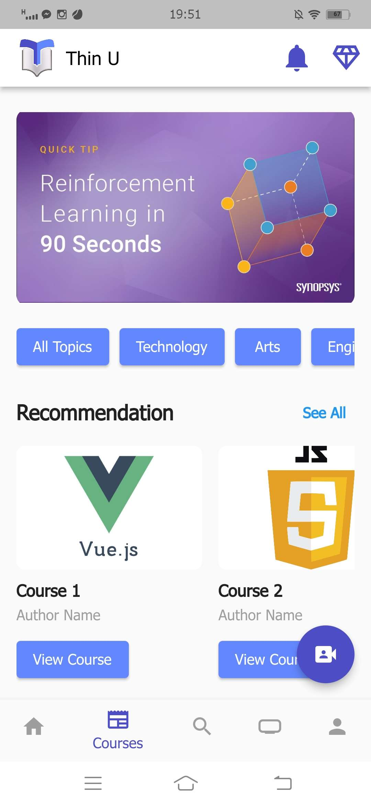
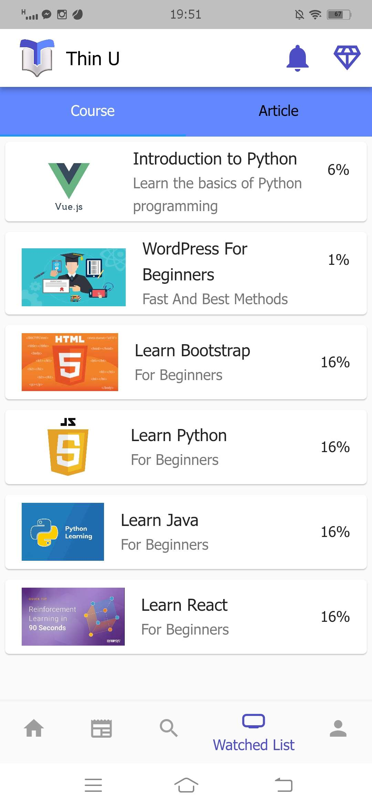

# STEM Learning Platform (Thin U)

  

Thinu is a mobile education platform developed for a **mobile application development competition**. The app was designed to provide accessible and structured STEM learning through a course-based system where students can learn new skills and educators can share their knowledge.

The platform combines a modern mobile interface with a structured learning environment, allowing users to explore educational content in an organized and engaging way.

---

## Project Overview

Thinu aims to create an educational ecosystem where students can access both free and premium STEM courses while educators can contribute content and potentially monetize their teaching.

The platform functions similarly to a **course-based learning platform**, where users can browse topics, enroll in courses, and follow structured lessons.

This project was developed during the **GUSTO Innovative Forum 2024 mobile application competition**.

---

## Key Features

### Student Features

- Browse available STEM courses
- Access both free and premium learning content
- Organized course structure for easier learning
- Mobile-friendly interface for convenient access
- Subscription-based access to advanced courses

### Platform Features

- Course-based learning structure
- Scalable architecture for multiple course categories
- User-friendly mobile UI design
- Support for both free and premium content

---

## Technologies Used

- **Flutter**
- **Dart**
- **MySQL Database**
- Mobile UI/UX Design
- REST-based backend communication

---

## Development Versions

### Prototype Version

The initial prototype version used **local mobile storage** to demonstrate application functionality and interface design.

### Extended Version

The later version integrated:

- Backend services
- Database storage
- Improved course management system

This allowed the platform to support **dynamic course content and scalable data management**.

---

## Screenshots

  
  
  

More screenshots available here:

[View all screenshots](screenshots/)

---

## Project Structure
